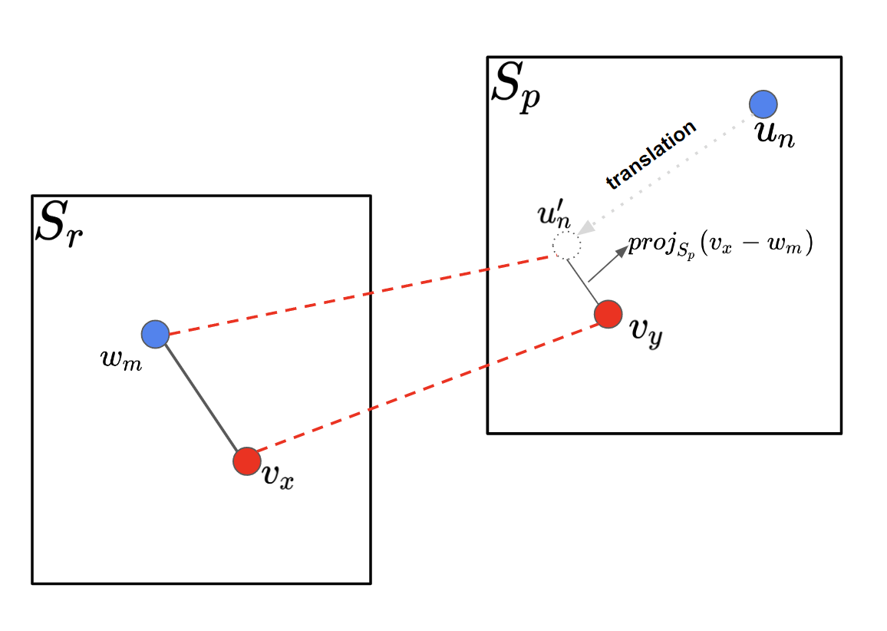

# TEMA: Token Embeddings Mapping for Enriching Low-Resource Language Models

> **Authors**: **[Rodolfo Zevallos](https://scholar.google.com/citations?user=m5CcYeQAAAAJ&hl=es&oi=ao), [Núria Bel](https://scholar.google.es/citations?user=AfK2EpIAAAAJ&hl=es&oi=ao), [Mireia Farrús](https://scholar.google.com/citations?user=rCvSHQ0AAAAJ&hl=es&oi=ao)**


<p align="center" width="100%">

</p>


💡**Highlight**:

1. TEMA for Enhancing Low-Resource Language Models: The Token Embedding Mapping Algorithm (TEMA) is the central proposal aimed at improving the quality of language models for low-resource languages. It maps the token embeddings from a richly pre-trained model (L1) to a poorly pre-trained model (L2), resulting in a richer and more accurate L2 model​.

2. Competitive Results and Reduced Perplexity: Experiments show that the L2 model enhanced with TEMA reduces perplexity and achieves state-of-the-art results on semantic tasks such as SuperGLUE, outperforming other approaches like multilingual models or traditional transfer learning techniques​.

3. Significant Impact on Languages with Complex Morphologies: TEMA was evaluated using Quechua, a low-resource language with complex morphology. The results demonstrated that TEMA substantially improves the semantic representation of tokens and accuracy in tasks such as part-of-speech tagging and named entity recognition, compared to other methods​.


## ⚙Requirements

- Python == 3.10, PyTorch == 2.0.1

## Installation

1. Clone the repository
2. Navigate to the repository directory
3. Install the dependencies

```
git clone https://github.com/IULATERM-TRL-UPF/TEMA
cd TEMA
pip install -r requirements.txt
```

## 🚀Quick Start

### 1. Prepare models (only for pre-training)


```
python src/main.py --act 1 --lang quechua
```

### 2. TEMA


```
python src/main.py --act 2 --l1 /root/model_l1 --l2 /root/model_l2
```

## 🖋Citation

If you have any questions, please feel free to submit an issue or contact `rodolfo.zevallos@bsc.es` or `nuria.bel@upf.edu`.

If our work is useful for you, please cite as:

```
@inproceedings{rodolfo2024,
      title={TEMA:Token Embeddings Mapping for Enriching Low-Resource Language Models}, 
      author={Rodolfo Zevallos and Núria Bel and Mireia Farrús},
      year={2024},
      booktitle = {},
      publisher = {Association for Computational Linguistics}
}
```

